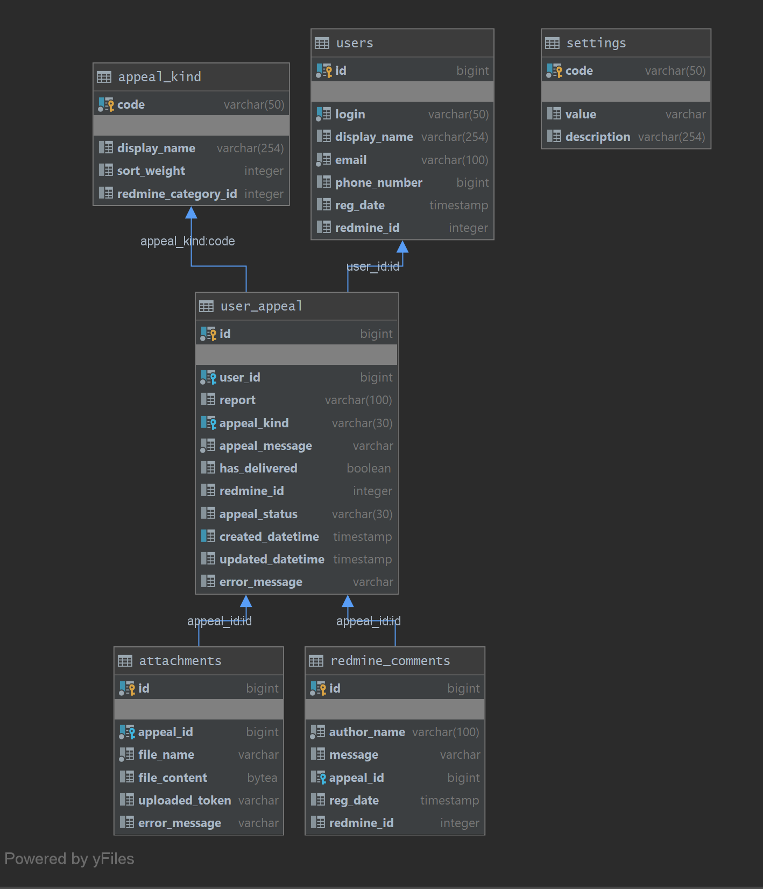

EN | [RU](README_ru.md) 

**Navigation**

- **Overview** (You are here)
- [Installation](./docs/INSTALLATION.md)
- [Configuration](./docs/CONFIGURE.md)
- [Deployment](./docs/DEPLOYMENT.md)

# ABOUT

This application creates new tasks in the Redmine system based on data from a database table.

## Database Schema

## Verbal Description of the Algorithm

### Exporting Requests

1. Periodically searches for new (status `CREATED`) or unprocessed (status `SENT_ERROR`) records in the `user_appeal` table in the database.
2. If found, it calls the [Redmine API](https://www.redmine.org/projects/redmine/wiki/Rest_api):
   1. Uploads files attached to the request by calling the `POST` method of [files](https://www.redmine.org/projects/redmine/wiki/Rest_Files) and saves the obtained identifiers.
   2. Creates an Issue object based on data in the request tables and uploads them to the Redmine server by calling the `POST` method of [issues](https://www.redmine.org/projects/redmine/wiki/Rest_Issues).

### Importing Requests

1. Periodically searches for unprocessed (statuses `SENT`, `EXTERNAL_COMMENT`, `INTERNAL_COMMENT`, `HANDLING`) records in the `user_appeal` table in the database.
2. If found, it calls the [Redmine API](https://www.redmine.org/projects/redmine/wiki/Rest_api):
   1. Downloads the issue by calling the `GET` method of [issues](https://www.redmine.org/projects/redmine/wiki/Rest_Issues) with the `include journals` flag and saves the obtained statuses in the database.
   2. Creates a `CommentEntity` object based on the received `Journal` entries and saves it in the `redmine_comments` table.
